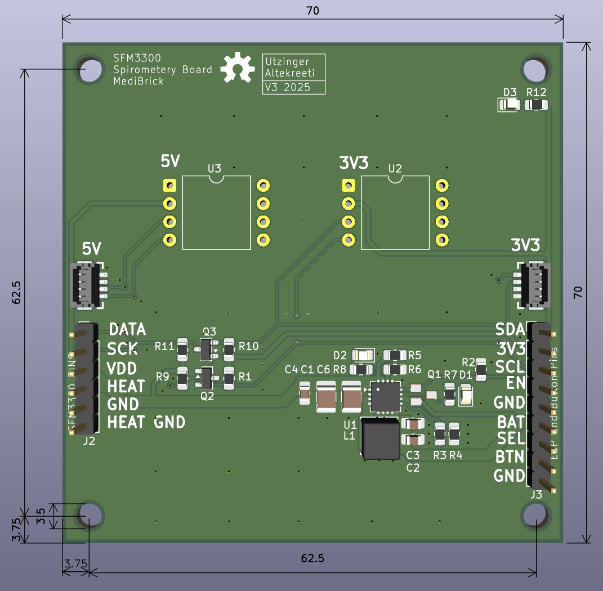
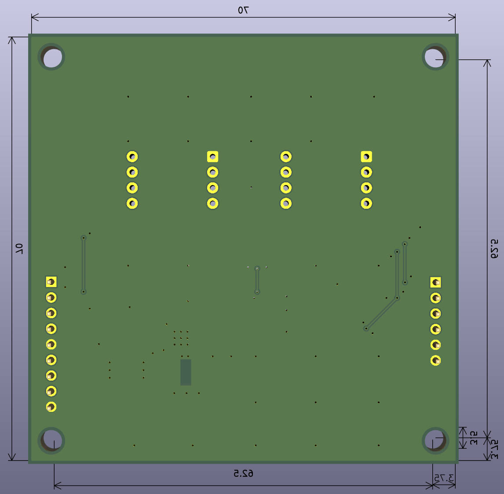

# Airflow / Spiro Brick

The Spiro Brick interfaces with the [Sensirion SFM3300-D](https://sensirion.com/products/catalog/SFM3300-D) airflow sensor. It also enables airway pressure measurement using Amphenol differential pressure sensor such as [ELVH-family](https://allsensors.com/en/product-listing?family=elvh) with I2C 3.3V or 5V interface.

- [Datasheet SFM3300](./datasheets/Sensirion_Datasheet_SFM3300-AW_SFM3300-D.pdf)
- [Datasheet ELVH Family](./datasheets/DS-0376.pdf)

Example differential pressure sensor with I2C and 5V interface: ELVH-M160D-HRRD-C-N2A5 for 1/16 ID 1/8 OD tubing.

## SFM3300

- [Cleaning](./datasheets/Sensirion_GF_AN_SFM-21_Cleaning_Methods_D1.pdf)
- [Eval Kit](./datasheets/Sensirion_GF_AN_SFM-22_ClipOn_CapCable_Evaluation_Kit_D1_1.pdf)

## Spiro Brick PCB Design

The following files were created for this project using KiCad.

[View schematics (PDF)](./KiCad/Altekreeti/Spiro_Brick.pdf)

## LiPo to 5V Power Boost

- [Ti TPS61090 Eval](./reference_designs/TPS61090_sbvu003.pdf)
- [Adafruit](https://learn.adafruit.com/adafruit-powerboost-500-plus-charger/downloads)