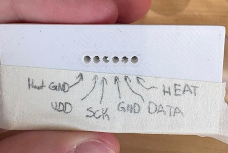
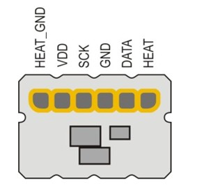

# Spirometer Mechanical Design

This folder contains the mechanical design files for the Spirometer Brick enclosure.

# Components needed:

3D printing of
•	[Faceplate OnShape-](https://cad.onshape.com/documents/8a012de4c38b63333db6af02/w/265b6d782bd2385b1745b6bb/e/89639c93393428ddd956de37)
Purchasing of
•	[Pogo-Pins-](https://www.digikey.com/en/products/detail/mill-max-manufacturing-corp/0929-0-15-20-75-14-11-0/1873763)

#Instructions:
1. Gather all of the materials requested as well as solder, heat shrinks, and the soldering iron from the Salter Lab.
2. Follow the electrical assembly instructions for the spirometer listed on the GitHub, this should leave one with an ESP with 6 unsoldered wires that will be attached to the faceplate.
3. Tape a section above the back of the faceplate and label it as so:

## Faceplate Pinout

  

This will reduce any confusion of where to solder each wire from the ESP to the pogo pins.  As the wiring to the sensor must be accurate with the datasheet design found below:

## Sensor Pinout

  

4.⁠ ⁠Pass heat shrink onto all 6 wires that will be soldered onto the pogo pins. This prepares the heat shrink for step 6
5.⁠ ⁠⁠Solder the wires onto the pogo pins. The instructions for which pin attaches to which wire is listed on the spirometer electrical assembly. It is helpful to space each wire out so the chance of pins shorting or soldering to each other is avoided.
6.⁠ ⁠⁠Pull the previously placed heat shrink over the soldered portion. Do not heat the heat shrink to set it at this stage
7.⁠ ⁠⁠Push the pins into the holes of the spirometer faceplate. Make sure that the pins go into the faceplate as far as possible, and all of the spring-loaded portion of the pogo pin is visible on the connector face. This can be done by taking a flat tool like a screwdriver and pushing the pin until its bottom is flush with the faceplate.
8.⁠ ⁠⁠After adjusting the heat shrink as needed such that it sufficiently covers the backside of the pins and the soldered portion, heat them with a heat gun to set them. Visually inspect to make sure there are no accidental shorts between the pins. The heat shrink should provide an extra layer of insulation to protect from short circuits.

## Designer
Mechanical design provided by Shafayet.