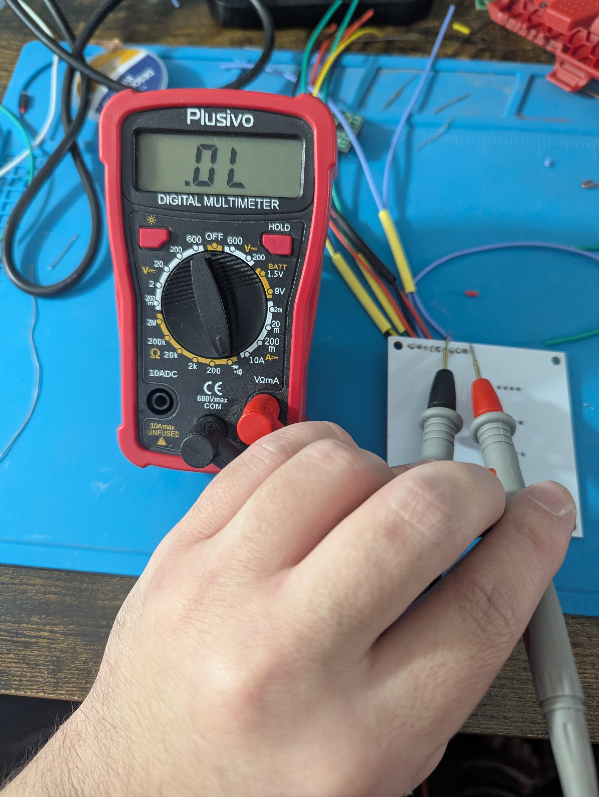
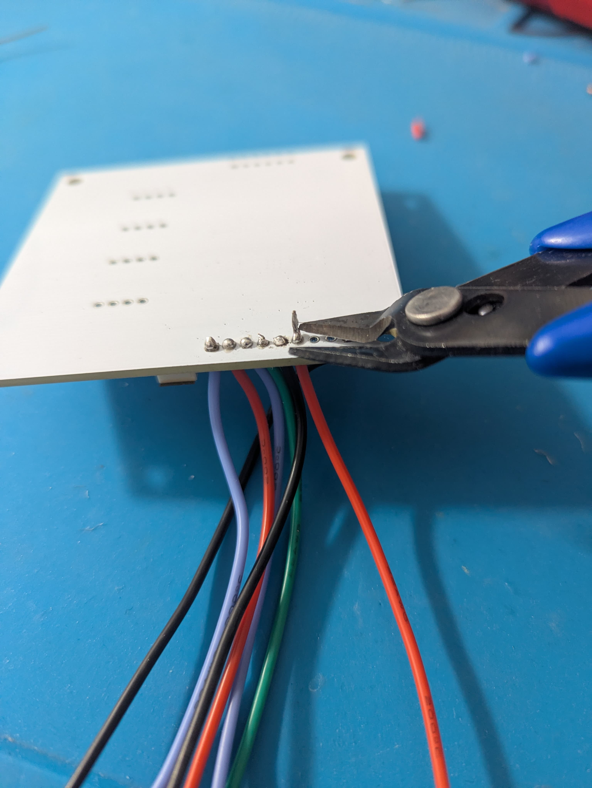
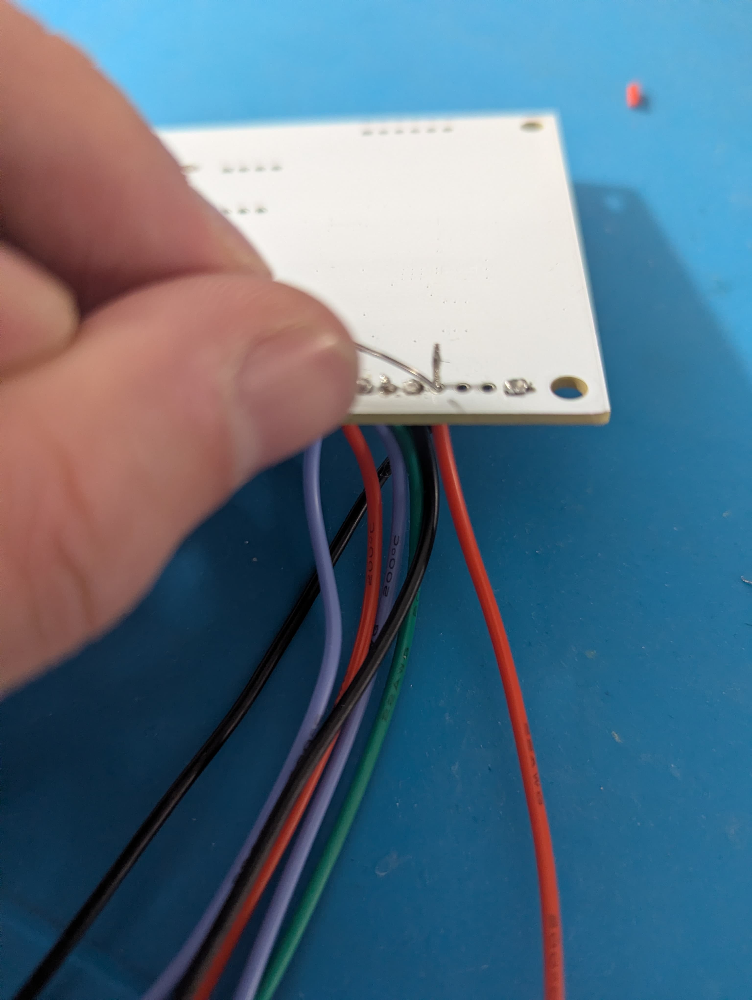
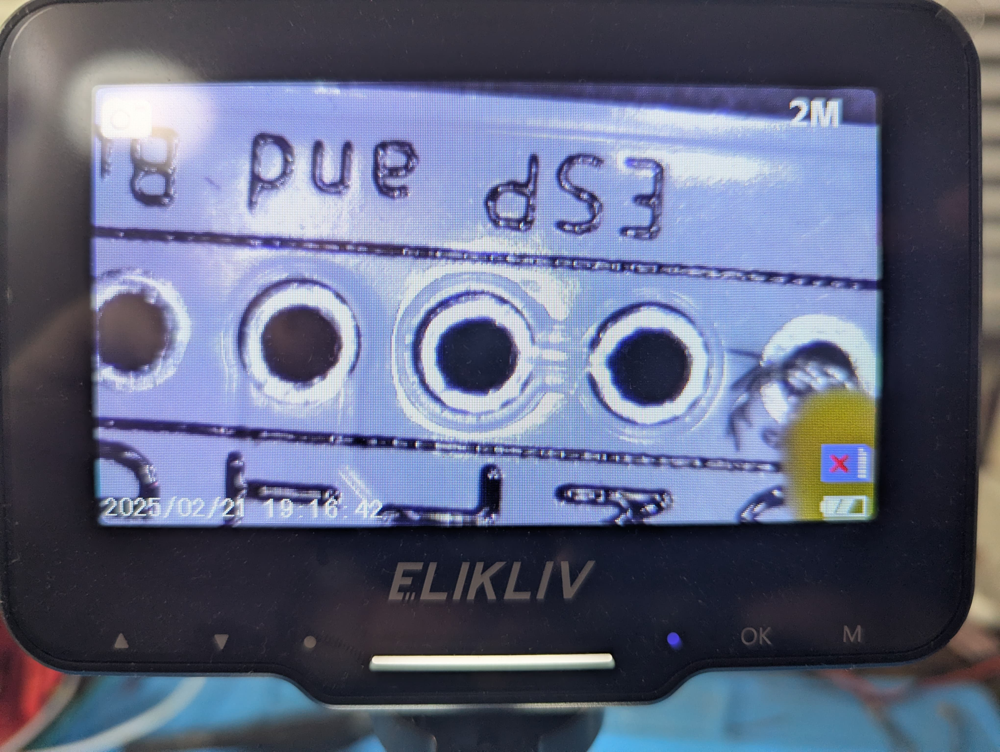
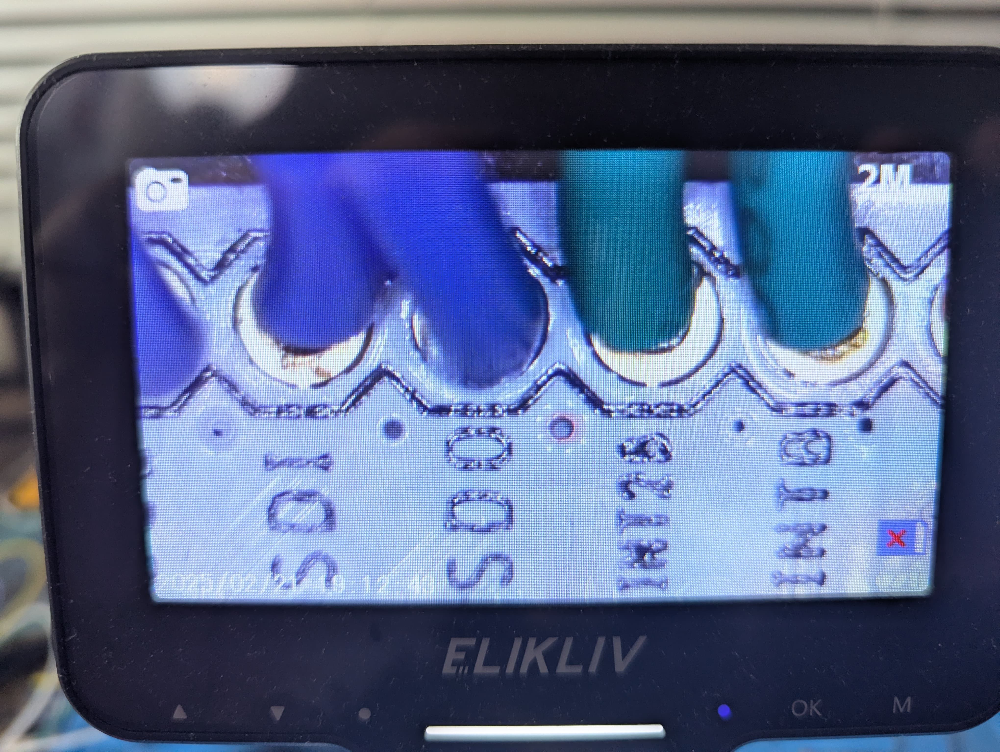

### : Assembly and Use Instructions

Spirometer

Electrical Assembly Soldering

*SFM3300 Flow Sensor Connection (SFM headers)*

The left side header of the Spirometer MediBrick is dedicated to the SFM3300 airflow sensor interface.

Firmly insert wires or a pin header into the pads labeled DATA, SCK, VDD, HEAT, and GND. These pads are directly connected to the corresponding SFM3300 sensor pins.

Solder each connection securely, ensuring correct alignment and solid solder joints for reliable airflow measurement and heater control.

*Microcontroller Interface (Right Side Header)*

The right-side header is used to connect the Spirometer MediBrick to the Adafruit Feather ESP32-S3 microcontroller.

Insert wires or a header into the pads labeled SDA, SCL, 3V3, GND, EN, BAT, SEL, BTN, and GND. Solder all required pins carefully, avoiding solder bridges between adjacent pads.

##### Wires

Attach color-coded wires to the I/O pads as follows:

-Red: Power (3V3)

-Black or Green: Ground (GND)

-Blue or White: I²C signals (SDA, SCL)

-Other colors: Control signals (EN, BTN)

Wires may be inserted directly into the through-holes (perpendicular) or attached as short pigtail leads soldered onto the pads.

*Suggested Connections to the Adafruit Feather ESP32-S3*

The recommended connections between the Spirometer MediBrick and the ESP32-S3 are shown below:

PCB

ESP

SDA

SDA

3V3

3.3

SCL

SCL

EN

A5

GND

GND

BAT

VBAT

SEL

GPIO9

BTN

Button

GND

Button

Final Inspection
 
After assembly:

-Verify all solder joints are clean and fully wetted.

-Confirm correct wiring orientation for the SFM3300 sensor.

-Check continuity for power and ground connections using a multimeter.

-Ensure no short circuits exist between adjacent pins.

-Run I2C check

-Run the test code

Once completed, the Spirometer MediBrick is ready for enclosure integration and functional testing with the ESP32-S3.

Mechanical Assembly

##### Fabricated Components:

MediBrick shell top half and bottom half (3D Printed)

Spirometer faceplate (3D Printed)

PCB (3rd Party Fabrication)

##### Bought Components:

Connector pins x6

Battery x1

ESP32-S3 Microcontroller x1

Brass inserts (M3 x4, M2.5 x4)

Three parts need to be 3D printed for the Spirometer: the shell top, shell bottom, and the faceplate. These parts were successfully printed on a Prusca Mini with a 0.4mm nozzle, 15% infill, and the print quality set at default. Print time is approximately 40-60 minutes for the faceplate, and 4 hours for each half of the shell. Enabling support structures is not necessary.

Once printed, brass inserts may be placed within the designated holes of the shell. The PCB holes are present on the top half of the shell, and accept M3 brass inserts, and the microcontroller holes are on the bottom half, and accept M2.5 brass inserts. After the inserts are placed, the PCB and the microcontroller may be screwed on using the appropriate screws and nuts. The battery may be slid into the battery holder on the bottom half.

To assemble the faceplate, insert the connector pins into the holes from the back of the plate (flat side), making sure that they were fully seated within the faceplate and cannot go any further. If it is very difficult to get the pins to get fully seated, a 1.5mm drill bit may be used to ream the holes and get rid of any printing defects.

At this point, the spirometer components may be wired together. Please refer to the wiring section (6.1.1) for instructions.

Once wiring of the spirometer is complete, slide the faceplate into the wider slot of the bottom half, and the display into the smaller slot. Carefully slide the top half onto the assembly, taking care that the faceplate and the display and seating into their respective slots that are cut into the top half. Press down on the box until it clicks into place, and the two halves are flush with each other.

Testing

This section will deal with the testing methods and procedures of the Spirometer MediBrick.

*Critical Design Element*

The critical design element for the Spirometer MediBrick is the accuracy of data collection. It is crucial that the SFM spirometer sensor collects accurate data which in turn can

be used for proper conclusions to be drawn. Improper data collection could interfere with the learning of the beginning engineers that will create our product. Since the SFM sensor measures flow rate, an algorithm is needed in the ESP code in order to convert said flow rate into volume.

*Verification set up and procedure*

Verification Setup

Verification of the Spirometer MediBrick was performed using a calibrated 3 L syringe to generate known and repeatable airflow volumes. The syringe was connected to the inlet of the Sensirion SFM3300-D thermal mass flow sensor via medical-grade breathing tubing and standard respiratory connectors. The tubing was arranged to remain as straight as possible in order to minimize flow disturbances.

The assembled spirometer was secured on a test bench during verification. The ESP32- S3 microcontroller was connected to a laptop via USB-C to provide power and enable serial data logging during testing.

Verification Procedure

Verification testing was conducted by performing controlled push and pull strokes of the calibrated 3 L syringe. Each push stroke corresponded to an exhalation event, and each pull stroke corresponded to an inhalation event. Multiple push–pull cycles were performed to evaluate repeatability of the spirometer measurements.

During testing, instantaneous flow rate data were recorded by the firmware and integrated over time to compute inhaled and exhaled volumes. The recorded data were used to verify correct system operation and compliance with the spirometer system requirements defined in the System Requirements Verification Matrix (SRVM).

*Results: Volume Measured From 2.46L Syringe*

**Test Number**

**Measurement (L)**

**1**

2.36

**2**

2.34

**3**

2.38

**4**

2.4

**5**

2.4

**AVERAGE**

**2.376**

Results showed a 3.41 percent error from the Spirometer Medibrick with the 2.46L syringe as the control reference.

Full assembly

Peltier Control

This section describes the mechanical and electrical assembly of the dual-channel Peltier Controller MediBrick. The controller interfaces with an external 24 V DC power supply, two Peltier elements, temperature sensors, cooling fans, and an Adafruit Feather ESP32-S3 microcontroller for closed-loop thermal control.

Electrical Assembly

##### Soldering

Power Input (24 V DC)

The Peltier Controller MediBrick is powered using an external 24 V DC wall supply connected through an XT60 connector.

The XT60 connector is soldered directly to the PCB pads labeled +24V and GND, providing a secure, polarized, and high-current-rated connection suitable for sustained Peltier operation. Care must be taken to verify correct polarity before soldering, as the XT60 connector supplies power to both the H-bridge power stages and the onboard DC–DC converters.

All XT60 solder joints must be fully wetted and mechanically secure to safely support high- current loads during heating and cooling cycles.

**PCB Pad**

**Function**

**Source**

**+24V**

Main Power Input

24 V DC via XT60 Connector

**GND**

Return

XT60 Ground

*Footnote for Safety Sections: *The XT60 connector was selected due to its high current rating, keyed polarity, and mechanical robustness, reducing the risk of accidental reverse polarity or connector overheating during high-power operation.

Microcontroller Interface (ESP32-S3)

The controller interfaces with an Adafruit Feather ESP32-S3 using PWM, enable, and I²C signals. Solder wires or headers to the PCB pads corresponding to the logic and control signals. Control wiring should be kept short and routed away from high-current traces to minimize noise coupling from the switching power stage.

*Suggested Connections — ESP32-S3 Interface*

**PCB Pad**

**Function**

**ESP32-S3 Feather Pin**

**3V3**

Logic & Sensor Power

3V3

**GND**

Ground

GND

**TS1**

Temp Sensor Ch. 1

A0

**TS2**

Temp Sensor Ch. 2

A1

**TS3**

Temp Sensor Ch. 3

A2

**TS4**

Temp Sensor Ch. 4

A3

**1H1**

Channel 1 High-Side PWM

13

**1L1**

Channel 1 Low-Side PWM

11

**1H2**

Channel 2 High-Side PWM

12

**1L2**

Channel 2 Low-Side PWM

10

**2H1**

Channel 1 High-Side PWM

5

**2L1**

Channel 1 Low-Side PWM

9

**2H2**

Channel 2 High-Side PWM

6

**2L2**

Channel 2 Low-Side PWM

A4

##### Peltier Element Connections

Each Peltier channel interfaces to its Peltier element through a dedicated XT30 connector, providing a secure, polarized, and high-current connection suitable for bidirectional operation. Two XT30 connectors are used in total:

XT30-1 → Peltier Channel 1

XT30-2 → Peltier Channel 2

The XT30 connectors are soldered directly to the PCB pads labeled PE1 and PE2, respectively. These connectors carry the full H-bridge output current and must be soldered with adequate solder volume and mechanical support.

Heating and cooling direction is controlled electronically by the H-bridge; the XT30 connector polarity does not need to be changed during operation.

*Peltier Element Connection Table*

**PCB Pad**

**Connector**

**Function**

**External Connection**

**PE1+ / PE1−**

XT30-1

Peltier Channel 1

Peltier Element 1

**PE2+ / PE2−**

XT30-2

Peltier Channel 2

Peltier Element 2

***Safety/Assembly Note (Recommended)***

Each Peltier element is driven by a full H-bridge consisting of four IRF3205 MOSFETs per channel (eight total), with outputs routed to XT30 connectors to support high-current, low- resistance connections. Additionally, XT30 connectors were selected for the Peltier outputs due to their compact size, keyed polarity, and current handling capability. During assembly, ensure that the XT30 housings are fully seated and that solder joints are inspected for cold joints or insufficient wetting.

Fan Connections

Two 12 V fans are used for active heat dissipation from the Peltier heat sinks. Insert and solder the fan leads into the PCB pads labeled Fan:

Red wire → +12V

Black wire → GND

Ensure correct airflow direction relative to enclosure vents. Temperature Sensor Connections

Temperature feedback is provided using LM35 analog temperature sensors.

Solder each sensor or sensor lead to the PCB pads labeled TS1–TS4, observing correct orientation:

VCC → 3.3 V

OUT → Analog signal

GND → Ground

These sensors provide real-time thermal feedback for closed-loop control.

##### Wiring

Use appropriate wire gauges for each subsystem:

High-current paths (XT60 input, XT30 inputs and Peltier outputs): thick stranded wire

Logic and sensor signals: thin insulated wire

Suggested color coding:

-	Red: Power (+24 V, +12 V, +3.3 V)

Black: Ground

Blue / White: PWM and logic signals

Green / Yellow: Temperature sensor outputs

##### Safety and Verification

Before applying power:

Verify no short exists between **+24 V and GND **using a multimeter.

Confirm correct polarity of the XT60 connector.

Verify correct orientation of bootstrap diodes (1N4148) and placement of decoupling capacitors (0.1 µF, 10 V, non-polarized) and bulk capacitors (1 µF, 25 V, polarized).

Ensure fans spin freely and airflow paths are unobstructed.

Confirm the emergency stop switch (if installed) interrupts the 24 V supply.

After verification, the Peltier Controller MediBrick is ready for firmware upload and closed-loop thermal testing.

Mechanical Assembly

Testing

Critical Design Element

*Verification Setup and Procedure*

*Results*

Full assembly

ECG-Bioimpedance

Electrical Assembly

##### Soldering

Firmly press the 3.5mm connector into the holes and solder all three pins.

##### Wiring

Attach color-coded wires to the IO pads (e.g., red for power, black or green for ground, and blue or white for digital IO). Insert the wires into the holes perpendicularly. Connections for the Adafruit Feather ESP32-S3 are as follows:

**PAD**

**Function**

**Feather ESP32-S3 Pin**

**VCC**

Power

3V3

**GND**

Power

GND

**CS0**

Chip Select

6

**SDI**

Master Out Slave In

MO

**SDO**

Master In Salve Out

MI

**SCL**

Serial Clock

SCK

**INTB**

Interrupt Output

12 GPIO12

**INT2B**

Interrupt 2 Output

13 GPIO13

##### Final Inspection

Ensure that the 3.5mm connector is soldered with no cold connections.

Ensure every wired connection correctly corresponds to the table above.

Ensure no loose connections.

Run IC initiation test via SPI.

Mechanical Assembly

Testing

Stethoscope

Electrical assembly

##### Wiring

Attach color coded wires to the IO pads. E.g. red for power, black or green for ground and blue or white for digital input/output and yellow for analog wires. Insert the wires perpendicular to the holes. Follow the following table for ESP32-S3 Feather connections.

**PAD**

**Function**

**ESP32-S3 Feather Pin**

**GND**

Ground

GND

**3.3V**

Power

3V3

**PAD**

**Function**

**ESP32-S3 Feather Pin**

**SDA**

SDA / CDATA

SDA / GPIO3

**SCL**

SCL / CCLK

SCL / GPIO4

**DOUT**

Data Out

MISO / GPIO37

**LRCLK**

WS/Word Clock

A5 / GPIO8 / ADC1-CH7

**DIN**

Data In / DSDIN

MOSI / GPIO35

**SLCK**

Bit Clock

SCK / GPIO36

**MCLK**

Master Clock

A4 / GPIO14 / ADC2-CH3

**3.3V**

Power

3V3

Button

The button is configured to pull a pin high. One button pin is connected to 3.3V and the other to the input pin on the microcontroller. In software that pin is pulled low.

**PAD**

**Function**

**Feather**

**3.3V**

Power

3V3

**Button**

Button

12

Pressure Sensor

The MPRLS0300YG end of conversion output and external reset input.

**PAD**

**Function**

**Feather**

**EOC**

End of Conversion

D10

**RST**

Reset

D11

##### Final Inspection

Ensure every wired connection correctly corresponds to the tables above.

Ensure no loose connections.

Run IC initiation test.

Demonstrate that circuit responds to button pushes.

