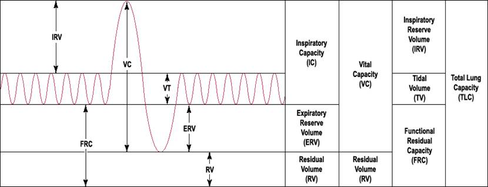
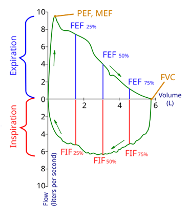
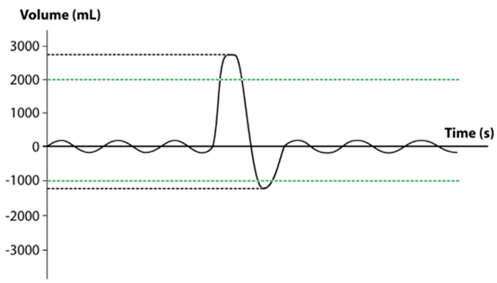
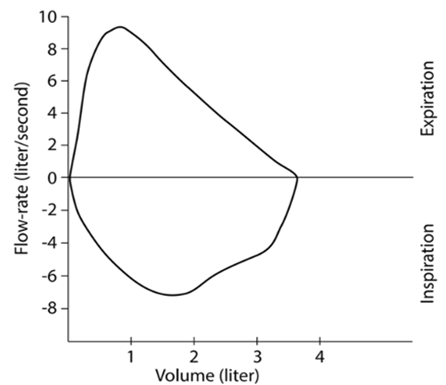
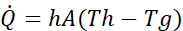
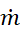
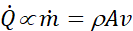
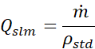
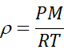
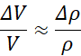

**Introduction to Spirometry and Lung Volumes**

Spirometry is a fundamental respiratory test used to assess lung function by measuring the volume and flow of air during inhalation and exhalation. The test provides insights into a patient's breathing patterns and can be used to detect and monitor respiratory diseases. The Figure below shows the key lung volumes measures which includes:

- **Tidal Volume (TV):** The amount of air inhaled or exhaled during normal, resting breathing (typically 400–600 mL).
- **Inspiratory Reserve Volume (IRV):** Additional air that can be forcibly inhaled after a normal inhalation (~ above 1700 mL).
- **Expiratory Reserve Volume (ERV):** Additional air that can be forcibly exhaled after a normal exhalation (~800–1200 mL).
- **Residual Volume (RV):** Air remaining in the lungs after maximal exhalation (~1200 mL); not measurable by spirometry.
- **Inspiratory Capacity (IC):** Maximum air that can be inhaled after a normal exhalation; **IC = TV + IRV.**
- **Functional Residual Capacity (FRC):** Volume of air in lungs after a normal exhalation; **FRC = ERV + RV**.
- **Vital Capacity (VC):** Maximum amount of air that can be exhaled after a maximal inhalation; **VC = IRV + TV + ERV**.
- **Total Lung Capacity (TLC):** Total volume the lungs can hold; **TLC = VC + RV.**
- **Forced Vital Capacity (FVC):** The total amount of air exhaled during a forced breath (~3000–5000 mL).
- **FEV₁%:** The percentage of the FVC exhaled in the first second; this value helps assess obstruction ( +%90).
- **FEF₂₅–₇₅:** The average flow rate during the middle portion of a forced exhalation (4.5 L/s).

By plotting **flow versus volume**, a spirogram is generated, providing a visual representation of lung performance. This is especially useful for distinguishing between:

- **Normal lungs:** Full volume range, symmetrical loop.
- **Obstructive disorders (e.g., COPD):** Normal volume but reduced flow rate; scooped-out expiratory curves.
- **Restrictive disorders:** Reduced total lung volume with preserved flow patterns.

**Diagnose Normal Lung Function, Obstructive, or Restrictive Lung Disorder**

|     |     |     |     |
| --- | --- | --- | --- |
| Measured Value | Normal | Obstructive (Reduced Flow) | Restrictive (Reduced Capacity) |
| Lung Volumes (TV, IRV and ERV) | Normal: Equal or more than the expected volumes | Normal: About the expected volumes | Low: Significantly less than expected volumes |
| FVC | Normal | Normal | Low: Lungs move less than the normal amount of air |
| FEV₁% | Normal: 90%+ | Low: Less than ~70% of normal air flow | Normal: Airflow is normal |
| FEF₂₅–₇₅ | Normal: Equal or more than the normal value | Low: Significantly less than normal | Normal: Airflow is normal |

Case Analysis.

|     |     |     |     |
| --- | --- | --- | --- |
|     | TV (mL) | IRV (mL) | ERV (mL) |
| Case 1 | 400 | 2600 | 1000 |

|     |     |     |     |
| --- | --- | --- | --- |
|     | TV (mL) | IRV (mL) | ERV (mL) |
| Case 2 | 500 | 2300 | 900 |

|     |     |     |     |
| --- | --- | --- | --- |
|     | FVC (mL) | **FEV₁%** | **FEF₂₅–₇₅ (L/s)** |
| Case 1 | 4000 | 50  | 0.7 |

|     |     |     |     |
| --- | --- | --- | --- |
|     | FVC (mL) | **FEV₁%** | **FEF₂₅–₇₅ (L/s)** |
| Case 2 | 3500 | 95  | 4.0 |

- **Case 1** has normal FVC (4000 mL) but severely reduced FEV₁% (50%) and FEF₂₅–₇₅ (0.7 L/s), indicating **obstructive lung disease**, likely COPD.
- **Case 2** displays near-normal values (FVC 3500 mL, FEV₁% 95%, FEF₂₅–₇₅ 4.0 L/s), indicating **normal lung function**.

**Preface:**

The spirometer brick is a part of _MediBrick Project_. This spirometer device is designed specifically for educational demonstration and student experiments. The goal is to help learners understand the physics behind respiratory mechanics and thermal mass flow sensing, rather than to provide medical diagnostic results. By visualizing real-time flow data and calculated volume, students can connect theoretical principles with hands-on measurement.

**Composition of spirometer:**

The spirometer is mainly composed of these parts:

- Mouth piece
- airflow tube
- Flow sensor

( other electronics will be added later )

**Basic principle**

The flow sensor used in this project is SFM3300-D This is a thermal mass flow rate sensor that directly measures airflow. It has a bidirectional range (±250 slm) and outputs a digital flow value. Because it provides real-time flow data for both inhalation and exhalation, we do not require a separate differential pressure sensor to generate the spirogram (Flow vs Volume curve). This simplifies the design and enhances measurement accuracy for educational and demonstration purposes.

SFM3300-D uses Thermal Mass Flow Sensing technology.

This equation is derived from the traditional theory of heat transfer and is the physical basis of the principle of thermal mass flow detection.

The working mechanism of SFM3300-D is based on this type of convective heat transfer and temperature difference detection. As the airflow passes through the sensor, it carries away the heat from the heating membrane, which calculates the mass flow rate by detecting changes in temperature difference, The heat-loss rate 

is proportional to the mass flow rate 

:

where 𝜌 is gas density, 𝐴 is the cross-sectional area, and 𝑣 is the average velocity.

Although the sensor measures rather than 𝑣, its digital output is converted to a standardized volume-flow rate​ 

under reference conditions:

lung volumes are obtained by time integration:

Thus, the sensor’s flow-rate output effectively represents the average airflow speed inside the device.

In conventional airflow measurement, the gas density 𝜌 is assumed constant. However, in human exhalation, the molar mass 𝑀 and temperature 𝑇 both increase compared to ambient air, according to the ideal-gas law:

where 𝑅 is the universal gas constant and 𝑃 is pressure. Typical changes in 𝑀 (due to added CO₂ and H₂O) and in 𝑇 (warmer exhaled air) cause 𝜌 to vary by about 2–5 %. If the system assumes a fixed density when converting flow to volume, this produces a proportional error in the computed lung volume:

That means a 5 % density change would lead to roughly a 5 % volume-calculation error.

The SFM3300-D avoids this problem by directly measuring mass flow rather than velocity or volume flow. Because the measured variable already includes 

. The sensor output inherently compensates for these density variations. Its on-chip digital temperature sensor further corrects for residual thermal effects, maintaining an accuracy of ±3 % of reading and only ±0.4 % per 10 °C temperature drift. These compensations are based on dry-air calibration. When measuring exhaled breath containing water vapor and CO₂, the gas properties slightly differ from the dry-air model, so an additional BTPS correction need to be applied in the spirometer software.

**Flow Measurement: Pressure Drop vs Thermal Sensing**

Traditionally, spirometers use a differential pressure sensor to measure the pressure drop across a resistance element and derive flow. However, the SFM3300-D sensor eliminates this need by providing direct mass flow measurement with high precision. Because it senses flow without relying on pressure differentials, there’s no need for multiple pressure ports or compensations.

By measuring mass flow directly, the SFM3300-D also inherently accounts for changes in gas density and temperature. This improves accuracy compared to simple velocity-based methods, especially when measuring exhaled air, which is warmer and contains more water vapor.

**Future Enhancements: Airway Pressure Monitoring**

Although a pressure sensor is not required for spirometry, adding one could expand the functionality of the device. For example, airway pressure monitoring is essential in applications like CPAP therapy, mechanical ventilation, and anesthesia machines. In these systems, pressure data is used to control airflow, protect the airway, and detect patient-triggered breathing efforts.

Sensirion’s evaluation kit for the SFM3300 series includes a clip-on module with a built-in pressure sensor, demonstrating how pressure sensing can be incorporated into a flow-based system. In future iterations, we may add such a sensor to study airway pressure dynamics alongside flow, further enriching the educational experience.

**Directions for use:**

( To be added, full components, Schematics, step by step Assembly instructions, Software/operation instructions / CAD models and electronics )